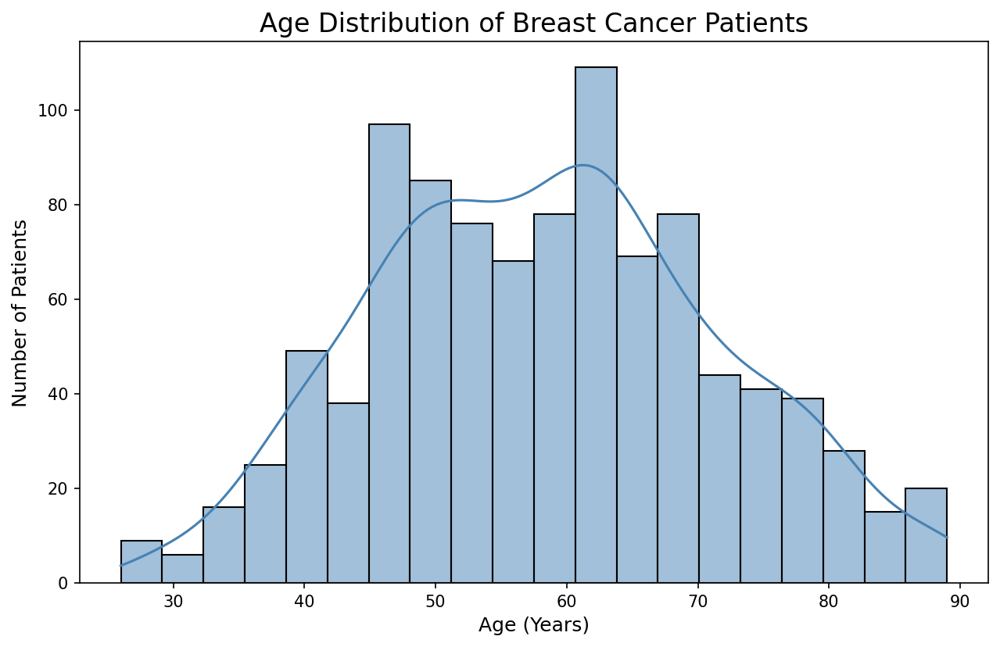
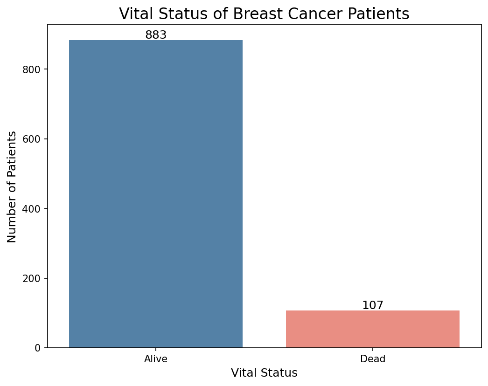
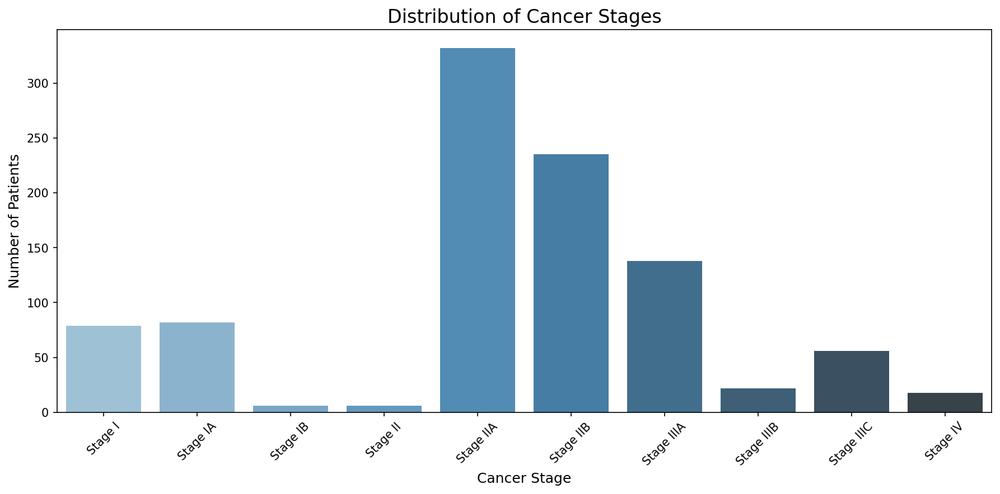
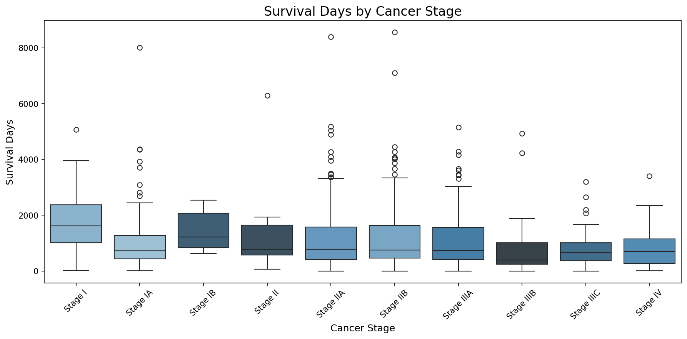
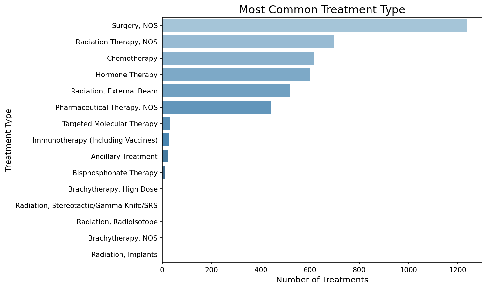

# TCGA Breast Cancer Clinical Analysis

## Project Overview

This project analyses clinical data from 990 breast cancer patients from The Cancer Genome Atlas (TCGA) Breast Cancer (BRCA) dataset. TCGA is a large scale public database funded by the US government that contains clinical, genomic, and treatment data from thousands of real cancer patients across America. The goal of this analysis is to explore relationships between cancer stage, patient age, treatment type, and survival outcomes, the kind of foundational analysis required before building any AI model for cancer research.

## Dataset

- **Source:** The Cancer Genome Atlas (TCGA) - GDC Data Portal
- **Dataset:** TCGA-BRCA Clinical Data
- **Patients analysed:** 990 breast cancer patients
- **Variables used:** Age, vital status, cancer stage, survival days, treatment type

## Visualisations

### Age Distribution

Breast cancer predominantly affects patients aged 45-70, with peak diagnosis occurring around age 60-65. Very few cases occur below age 35.

### Vital Status

89% of patients in this dataset are still alive at their last follow up, reflecting effective treatment outcomes and relatively early stage diagnoses in this cohort.

### Cancer Stage Distribution

The majority of patients were diagnosed at Stage IIA and Stage IIB, indicating most cancers were detected at a moderately early stage. Very few patients presented with Stage IV disease.

### Survival Days by Cancer Stage

There is a clear trend showing that patients diagnosed at earlier stages survive significantly longer. Stage I patients survived on average 4.9 years compared to only 2.2 years for Stage IIIC patients.

### Treatment Types

Surgery is the most common treatment followed by Radiation Therapy and Chemotherapy. More specialised treatments like Immunotherapy and Targeted Molecular Therapy are rarely used in this cohort.

## Key Findings

### 1. Patient Overview
- 89% of patients are alive at last follow up
- Average patient age at diagnosis: 58.5 years
- Average survival time: 1189 days (~3.3 years)

### 2. Cancer Stage and Survival
- Stage I patients survived ~1786 days on average (~4.9 years)
- Stage IIIC patients survived ~793 days on average (~2.2 years)
- Clear trend: earlier stage = significantly longer survival

### 3. Age and Survival
- Patients under 40 survived ~1439 days on average
- Patients over 70 survived ~932 days on average
- Younger patients consistently survive longer across all age groups

### 4. Treatment and Survival
- Immunotherapy showed highest average survival: ~2043 days
- Surgery was the most common treatment
- Standard treatments show similar survival rates (~1200 days)

## Tools and Libraries

- Python 3
- Pandas: data loading and cleaning
- NumPy: numerical calculations
- Matplotlib: data visualisation
- Seaborn: statistical visualisation

## How to Run

1. Clone this repository
2. Install dependencies: `pip install pandas numpy matplotlib seaborn`
3. Open `notebooks/analysis.ipynb` in Jupyter Notebook
4. Run all cells in order

## Author

Ravindu Denuwan | 2026
